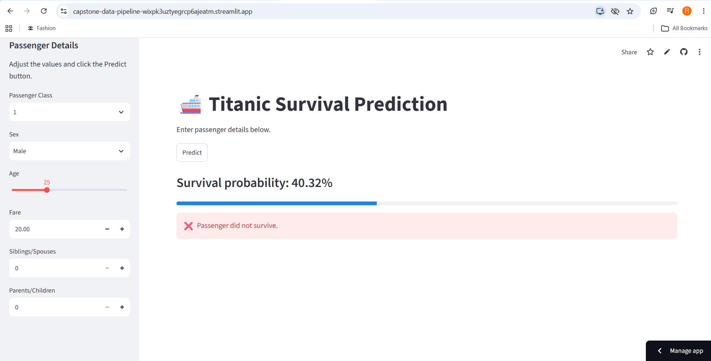

# 🚢 Titanic Survival Prediction

A complete end-to-end Machine Learning project that predicts whether a Titanic passenger would survive based on passenger information such as age, gender, passenger class, fare, and family details.

The project includes data preprocessing, feature engineering, model training, model serialization, and deployment using Streamlit Cloud.

---

# 📌 Problem Statement

The Titanic disaster is one of the most famous maritime tragedies in history. Given passenger information, the objective is to predict whether a passenger would survive using Machine Learning.

This project demonstrates a complete ML workflow from raw data to a deployed web application.

---

# 💡 Solution

The project follows an end-to-end Machine Learning pipeline:

- Data Collection
- Data Cleaning
- Data Preprocessing
- Feature Engineering
- Model Training
- Model Evaluation
- Model Serialization using Pickle
- Deployment using Streamlit Cloud

Users can enter passenger details through an interactive web interface and instantly receive:

- Survival Prediction
- Survival Probability

---

# 🚀 Features

- Interactive Streamlit Web Application
- Real-Time Prediction
- Survival Probability Score
- Data Cleaning & Validation
- Feature Engineering
- Machine Learning Classification Model
- Pickle Model Serialization
- Responsive User Interface
- Streamlit Cloud Deployment

---

# 🛠 Tech Stack

- Python
- Pandas
- NumPy
- Scikit-learn
- Matplotlib
- Seaborn
- Streamlit
- Pickle
- Git
- GitHub

---

# 📂 Project Structure

```text
CodeZoner_Capstone/
│
├── app.py
├── models/
│   └── model.pkl
├── src/
├── data/
│   ├── raw/
│   └── processed/
├── notebooks/
├── reports/
├── images/
├── README.md
├── requirements.txt
├── runtime.txt
├── .gitignore
└── Titanic_EDA.ipynb
```

---

# ⚙ Installation

## Clone the repository

```bash
git clone https://github.com/rohanchawla008-star/capstone-data-pipeline.git
```

## Move into project directory

```bash
cd capstone-data-pipeline
```

## Create virtual environment

```bash
python -m venv venv
```

## Activate virtual environment

### Windows

```bash
venv\Scripts\activate
```

### Linux / Mac

```bash
source venv/bin/activate
```

## Install dependencies

```bash
pip install -r requirements.txt
```

## Run the application

```bash
streamlit run app.py
```

---

# 📊 Model Output

The application predicts:

- Passenger Survival Status
- Survival Probability

---

# 📸 Application Screenshot



---

# 🌐 Live Demo

[Live Streamlit App](https://capstone-data-pipeline-wixpk3uztyegrcp6ajeatm.streamlit.app)

---

# 🔗 GitHub Repository

[GitHub Repository](https://github.com/rohanchawla008-star/capstone-data-pipeline)

---

# 📈 Future Improvements

- Hyperparameter Tuning
- Docker Containerization
- REST API Integration
- AWS Cloud Deployment
- User Authentication
- Database Integration

---

# 👨‍💻 Author

**Rohan Chawla**

CodeZoner Capstone Internship Project

---

# ⭐ Acknowledgements

This project was developed as part of the **CodeZoner Capstone Internship Program** to demonstrate the complete Machine Learning lifecycle, including data preprocessing, model development, deployment, and version control using Git and GitHub.